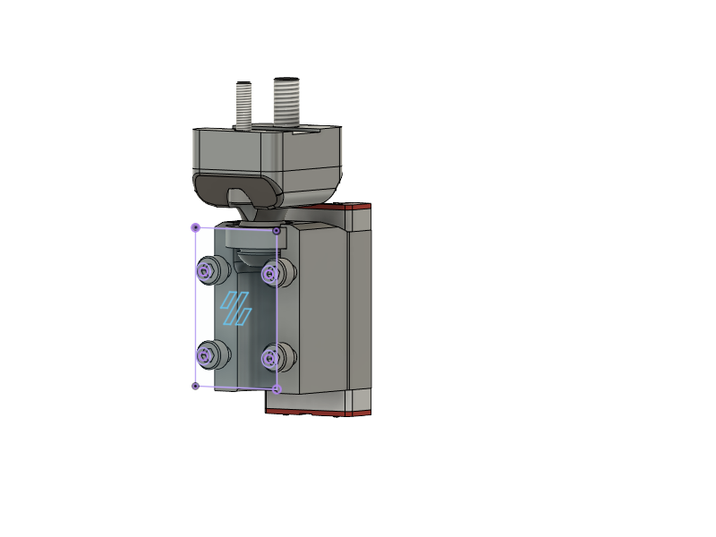
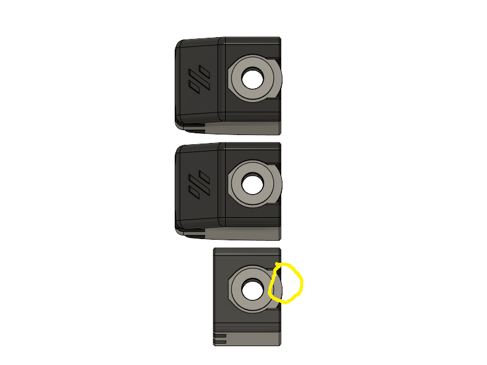
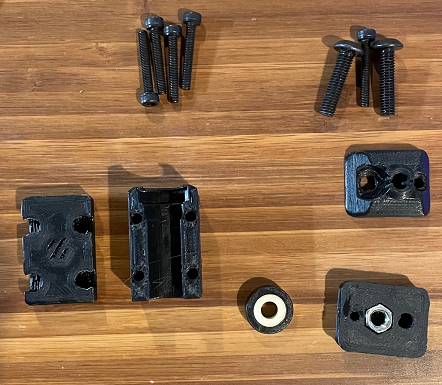

This mod replace the standard VORON 2.4 Z Joints with spherical bearings instead of curved printed parts anchored by an M5 bolt.  It was inspired by [hartk1213's GE5C mod](https://github.com/hartk1213/MISC/tree/main/Voron%20Mods/Voron%202/2.4/Voron2.4_GE5C) and created to allow the Z Joint to mount flush to the linear rail carriage and allow for use of the stock gantry parts and I really didn't want to print out the gantry parts for the Nth time.

hartk1213's mod requires that the lower portions of the Front Idlers and A B drive mounts be reprinted because the M5 bolt needs to be offset slightly from the stock location.  However the offset on the Front Idlers is not enough, so the GE5C bearing is proud on the back of the carriage mount and prevents it from sitting flush.  This can't be change without risk of damaging the front Z belts.  Additionally it isolates the changes to the Z Joints reducing the number of variations required to support future Gantry mods.

There are 4 printed parts:
-  Belt Clamp - This houses a captive M5 nut. There is also some additional room for an M5 bolt to extend past the M5 nut. It will break though a thin 0.2mm layer which was put in place to support creating the hole above the captive nut.
-  Pivot Joint - This allows for free movement above the GE5C bearing and is anchored along with the Belt Clamp to the the lower part of the 2020 extrusions with 1 M5x20 BHCS and 1 M3x20 SHCS bolts.
-  Body - The holds the GE5C bearing captive a single M5x20 BHCS which is thread up through the GE5C bearing, Joint, and into the captive M5 nut
-  Face - Secures the body to the MGN9H carriage and locks the GE5C bearing in place with 4x M3x20 SHCS bolts

Required Hardware for 4x Z Joints

- 4x  GE5C bearings
- 20x M3x20 SHSC bolts
- 8x  M5x20 BHSC bolts
- 4x  M5 nuts

Note: These were built as I been mod'ing and building my first VORON 2.4, so they actually haven't been used in printing yet and may need an additional variation for endstops.

